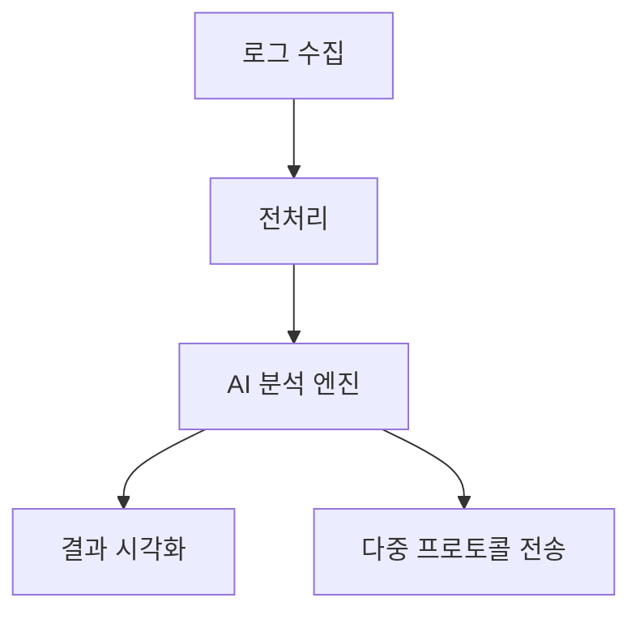
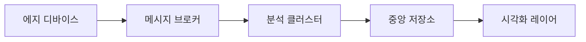

# AI 로그 분석기 및 GPT API 기반 창의적 애플리케이션 개발 종합 가이드

## 1. AI 로그 분석기 구현 전략

### 1.1 시스템 아키텍처 설계


### 1.2 핵심 기능 구현 요건
**1.2.1 로그 분석 파이프라인**
- **다형성 로그 수집**: Syslog[3], Beats[6], OTLP/gRPC[10][14] 프로토콜 지원
- **정규화 엔진**: 
```python
class LogNormalizer:
    def __init__(self):
        self.patterns = {
            'timestamp': r'\d{4}-\d{2}-\d{2} \d{2}:\d{2}:\d{2}',
            'error_code': r'ERR\d{4}'
        }
        
    def parse(self, raw_log):
        for key, regex in self.patterns.items():
            match = re.search(regex, raw_log)
            if match:
                yield (key, match.group())
```

**1.2.2 AI 분석 모듈**
- **Transformer 기반 이상 탐지**[19]:
```python
from transformers import AutoModelForSequenceClassification

model = AutoModelForSequenceClassification.from_pretrained(
    "log-analysis/LogRCA",
    num_labels=2
)
```

**1.2.3 다중 프로토콜 출력**
```python
def send_results(result, protocol):
    if protocol == 'syslog':
        syslog.send(result)
    elif protocol == 'mqtt':
        mqtt_client.publish('logs/analysis', result)
    elif protocol == 'otlp':
        otlp_exporter.export(result)
```

### 1.3 구현 로드맵
1. **데이터 수집 계층**: Fluentd[6] 플러그인 개발
2. **분석 엔진**: AI-Log-Analyzer[11] 커스터마이징
3. **시각화 인터페이스**: Streamlit[9] 대시보드 통합
4. **프로토콜 어댑터**: Syslog[3], MQTT[4], OTLP[14] 구현

## 2. GPT API 기반 애플리케이션 개발

### 2.1 프롬프트 엔지니어링 전략
**구조화된 출력 생성 예시**:
```python
prompt_template = """
너는 전문 IT 시스템 분석가야. 다음 로그를 분석해줘:

{log_input}

반드시 JSON 형식으로 다음 키들을 포함해야 해:
- error_type: 오류 분류 (최대 3단계 계층)
- root_cause: 근본 원인 (50자 이내)
- solution: 해결 방안 (단계별 목록)
- severity: 위험도 (1-5)
"""
```

### 2.2 Streamlit UI 설계 원칙
```python
import streamlit as st

with st.sidebar:
    st.header("분석 설정")
    temperature = st.slider("창의성 수준", 0.0, 1.0, 0.7)
    
col1, col2 = st.columns([3, 2])
with col1:
    input_log = st.text_area("로그 입력")
with col2:
    if st.button("분석 실행"):
        response = call_gpt_api(input_log)
        st.json(response)
```

### 2.3 창의적 애플리케이션 아이디어
1. **실시간 로그 번역기**
   - 다국어 로그 → 표준화된 영어 로그 변환
   - 오류 코드 기반 상황 설명 생성

2. **자동 화이트페이퍼 생성기**
   - 시스템 로그 → 아키텍처 문서 자동 생성
   - 시퀀스 다이어그램 생성 기능

3. **보안 취약점 예측 시스템**
   - 로그 패턴 → CVE 데이터베이스 연동
   - 공격 시나리오 시뮬레이션

## 3. 통합 개발 가이드라인

### 3.1 기술 스택 권장사항
| 분야 | 기술 선택지 |
|------|------------|
| 프론트엔드 | Streamlit[9], Plotly Dash |
| 백엔드 | FastAPI, Flask |
| AI 프레임워크 | PyTorch, TensorFlow |
| 로그 처리 | Fluentd[6], Logstash |

### 3.2 테스트 전략
**다단계 검증 프로세스**:
1. 단위 테스트: pytest 기반 모듈별 검증
2. 통합 테스트: Docker-compose 환경 구성
3. 부하 테스트: Locust를 이용한 성능 검증

### 3.3 성능 최적화 기법
- **로그 청크 처리**:
```python
def process_large_log(file_path, chunk_size=10000):
    with open(file_path) as f:
        while True:
            chunk = list(islice(f, chunk_size))
            if not chunk:
                break
            yield chunk
```

- **모델 경량화**:
```python
from torch import jit

optimized_model = jit.script(trained_model)
optimized_model.save("optimized_model.pt")
```

## 4. 제출물 준비 체크리스트

### 4.1 기술명세서 구성
```markdown
1. 시스템 개요
2. 아키텍처 다이어그램
3. 모듈 상세 설명
4. API 명세 (Swagger 형식)
5. 의존성 목록
```

### 4.2 소스코드 관리 전략
1. **Git 저장소 구조**:
```
├── app/
│   ├── core/          # 핵심 비즈니스 로직
│   ├── adapters/      # 프로토콜 어댑터
│   └── interface/     # 사용자 인터페이스
├── tests/
├── docs/
└── Dockerfile
```

2. **버전 관리 규칙**:
- 기능 개발: feature/[기능명]
- 버그 수정: hotfix/[이슈번호]
- 문서 작업: docs/[문서유형]

## 5. 고급 주제 확장

### 5.1 실시간 분석 파이프라인
```python
from kafka import KafkaConsumer

consumer = KafkaConsumer(
    'log-stream',
    bootstrap_servers='localhost:9092',
    value_deserializer=lambda m: json.loads(m.decode('utf-8'))
)

for message in consumer:
    process_log(message.value)
```

### 5.2 확장 가능한 아키텍처


본 가이드는 첨부된 연구 논문[18][19]과 산업 표준[3][6][10]을 기반으로 최신 AI 로그 분석 기술을 체계적으로 구현할 수 있는 방법론을 제시합니다. 각 단계별 구현 시 GitHub 저장소[8][11]의 예제 코드를 참조하여 개발 속도를 가속화할 수 있습니다.
