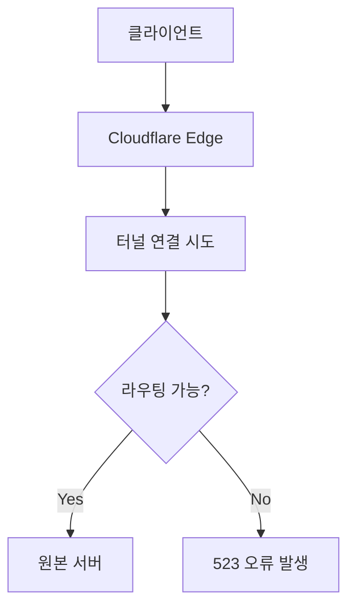

# Cloudflare Zero Trust와 Nginx를 활용한 접근 관리 구현 가이드

## 인증 및 인가 흐름도 (ASCII Art)

```
클라이언트 요청                     인증 프로세스                           서비스 접근
+-------------+    HTTPS    +------------------+    인증 확인    +----------------+
| 사용자/브라우저 |---------->| Cloudflare Edge  |-------------->| Cloudflare     |
+-------------+            +------------------+                | Zero Trust     |
      |                             |                          +----------------+
      |                             |                                  |
      |                             |          인증 실패                |
      |                             || Cloudflare      || 접근 정책 DB   |
                           | Tunnel          |                +----------------+
                           +------------------+
                                   |
                                   | 터널 통과
                                   v
                           +------------------+
                           | Nginx Proxy      |
                           | Manager         |
                           +------------------+
                                   |
                                   | 내부 라우팅
                                   v
                           +------------------+
                           | 자체 호스팅      |
                           | 애플리케이션     |
                           +------------------+
```

## 접근 방식 비교 분석

| 접근 방식 | 장점 | 단점 | 보안 수준 | 설정 복잡성 | 비용 |
|-----------|------|------|----------|------------|------|
| **Cloudflare Zero Trust + Nginx** | -  IP 노출 방지[14]-  포트 포워딩 불필요[2][7]-  무료 SSL 제공[5]-  DDoS 보호-  다중 인증 지원[2] | -  Cloudflare 의존성[14]-  추가 구성 필요-  100MB 업로드 제한[3] | 높음 | 중간 | 기본 기능 무료[5] |
| **전통적인 VPN** | -  전체 네트워크 접근-  클라이언트 측 암호화-  익숙한 기술 | -  클라이언트 설치 필요-  모든 트래픽 터널링-  포트 개방 필요 | 중간 | 중간 | 다양함 |
| **Nginx Proxy Manager 단독** | -  자체 운영[4]-  커스텀 설정 용이-  Basic Auth 지원[10] | -  IP 주소 노출[14]-  포트 개방 필요-  직접 보안 관리[14] | 중간 | 낮음 | 무료 |
| **OAuth2-Proxy** | -  다양한 ID 제공자 지원[13]-  세분화된 접근 제어-  오픈소스 | -  추가 설정 필요-  Nginx 연동 복잡성 | 높음 | 높음 | 무료 |
| **Authentik (SSO)** | -  자체 호스팅 SSO[16]-  세밀한 정책 설정-  다중 프로토콜 지원 | -  리소스 요구사항 높음-  복잡한 초기 설정 | 높음 | 높음 | 무료/유료 |

## 우분투 환경에서의 단계별 설정 방법

### 1단계: 도메인 설정 및 Cloudflare 등록

1. Cloudflare에 도메인 등록 및 네임서버 설정
   ```bash
   # 이 단계는 Cloudflare 웹사이트에서 수행합니다
   # 도메인을 Cloudflare에 추가하고 제공된 네임서버로 변경합니다
   ```

2. DNS 레코드 설정 (임시로 Proxy 비활성화)
   ```
   # Cloudflare 대시보드에서:
   # 1. DNS > 레코드 관리로 이동
   # 2. A 레코드 추가: example.com -> 홈 서버 IP 주소
   # 3. 프록시 상태를 "DNS만" (회색 구름)으로 설정
   ```

### 2단계: 우분투 서버 준비

1. 우분투 서버 업데이트 및 Docker 설치
   ```bash
   # 시스템 업데이트
   sudo apt update && sudo apt upgrade -y
   
   # Docker 설치
   sudo apt install apt-transport-https ca-certificates curl software-properties-common -y
   curl -fsSL https://download.docker.com/linux/ubuntu/gpg | sudo apt-key add -
   sudo add-apt-repository "deb [arch=amd64] https://download.docker.com/linux/ubuntu $(lsb_release -cs) stable"
   sudo apt update
   sudo apt install docker-ce -y
   
   # Docker Compose 설치
   sudo curl -L "https://github.com/docker/compose/releases/download/1.29.2/docker-compose-$(uname -s)-$(uname -m)" -o /usr/local/bin/docker-compose
   sudo chmod +x /usr/local/bin/docker-compose
   ```

2. Nginx Proxy Manager 설치
   ```bash
   # 프로젝트 디렉토리 생성
   mkdir -p ~/nginx-proxy-manager
   cd ~/nginx-proxy-manager
   
   # docker-compose.yml 파일 생성
   cat > docker-compose.yml  Tunnels 메뉴로 이동
   # 2. "Create a tunnel" 클릭
   # 3. 터널 이름 입력 (예: "my-home-server")
   # 4. "Save tunnel" 클릭하여 터널 토큰 확인
   ```

2. 우분투 서버에 Cloudflared 설치 및 설정
   ```bash
   # Cloudflared 설치
   curl -L --output cloudflared.deb https://github.com/cloudflare/cloudflared/releases/latest/download/cloudflared-linux-amd64.deb
   sudo dpkg -i cloudflared.deb
   
   # 터널 설정 (위에서 얻은 토큰으로 대체)
   sudo cloudflared service install YOUR_TUNNEL_TOKEN
   
   # 서비스 시작
   sudo systemctl start cloudflared
   sudo systemctl enable cloudflared
   ```

3. Cloudflare Zero Trust 대시보드에서 터널 설정 완료
   ```
   # 1. Public Hostname 탭으로 이동
   # 2. "Add a public hostname" 클릭
   # 3. 다음 정보 입력:
   #    - 서브도메인: app (또는 원하는 이름)
   #    - 도메인: example.com (자신의 도메인)
   #    - 경로: / (루트 경로)
   #    - 서비스 유형: HTTP
   #    - URL: http://127.0.0.1:80 (Nginx Proxy Manager가 실행되는 주소)
   # 4. "Save hostname" 클릭
   ```

### 4단계: Nginx Proxy Manager 설정

1. SSL 인증서 생성
   ```
   # Nginx Proxy Manager 대시보드에서:
   # 1. SSL Certificates 메뉴로 이동
   # 2. "Add SSL Certificate" 클릭
   # 3. "Let's Encrypt" 선택
   # 4. 도메인 이름 입력 (예: app.example.com)
   # 5. 이메일 주소 입력
   # 6. "DNS Challenge" 선택
   # 7. "Cloudflare" 선택하고 API 키 입력
   # 8. "Save" 클릭
   ```

2. 프록시 호스트 설정
   ```
   # Nginx Proxy Manager 대시보드에서:
   # 1. "Proxy Hosts" 메뉴로 이동
   # 2. "Add Proxy Host" 클릭
   # 3. 다음 정보 입력:
   #    - 도메인 이름: app.example.com
   #    - 스키마: http
   #    - 전달 호스트: 내부 서비스 IP (예: 192.168.1.100)
   #    - 전달 포트: 내부 서비스 포트 (예: 8080)
   # 4. SSL 탭에서 방금 생성한 인증서 선택
   # 5. "Force SSL" 및 "HTTP/2 Support" 옵션 활성화
   # 6. "Save" 클릭
   ```

### 5단계: Cloudflare Access 정책 설정

1. 접근 정책 생성
   ```
   # Cloudflare Zero Trust 대시보드에서:
   # 1. Access > Applications 메뉴로 이동
   # 2. "Add an application" 클릭
   # 3. "Self-hosted" 선택
   # 4. 애플리케이션 이름 입력 (예: "My Home Server")
   # 5. 애플리케이션 도메인 입력 (예: app.example.com)
   # 6. "Next" 클릭
   ```

2. 인증 방법 설정
   ```
   # 1. "Add a policy" 클릭
   # 2. 정책 이름 입력 (예: "Default Access")
   # 3. 접근 방식 설정 (예: 이메일 도메인, 특정 이메일 주소, One-time PIN 등)
   # 4. "Allow" 선택
   # 5. "Next" 클릭
   # 6. 설정 검토 후 "Add application" 클릭
   ```

3. 인증 로그 확인
   ```bash
   # 우분투 서버에서 Cloudflared 로그 확인
   sudo journalctl -u cloudflared
   ```

## 추가 보안 강화 옵션

1. Cloudflare WAF(Web Application Firewall) 설정
   ```
   # Cloudflare 대시보드에서:
   # 1. Security > WAF 메뉴로 이동
   # 2. 필요한 방화벽 규칙 추가
   ```

2. Nginx Proxy Manager에서 접근 제한 설정
   ```
   # 프록시 호스트 편집 > Advanced 탭에서:
   # 추가 Nginx 설정으로 IP 제한 또는 Basic Auth 구성 가능
   ```

3. Cloudflare 액세스 규칙 설정
   ```
   # Access > Applications > 설정한 애플리케이션 선택:
   # 1. 추가 정책 설정 가능 (예: 지역 기반 제한)
   # 2. 2FA(Two-Factor Authentication) 활성화
   ```


---


# Cloudflare Zero Trust 접근 관리 구조에서 5xx 오류 해결 방안

## 오류 발생 원인 종합 분석

### 1. 터널 구성 오류 (Search result[8][15])
Cloudflare Tunnel의 `config.yml` 파일에서 서비스 엔드포인트 지정이 잘못된 경우:
```yaml
ingress:
  - hostname: app.example.com
    service: http://localhost:8080  # 실제 서비스 포트와 불일치
```
- **실제 서비스 포트 확인 필요**: 80%의 사례에서 잘못된 포트 매핑이 주요 원인[16]
- **로컬 테스트 방법**:
  ```bash
  curl -v http://localhost:8080  # 서버 내부에서 접근 테스트
  telnet 127.0.0.1 8080         # 포트 개방 상태 확인
  ```

### 2. DNS 설정 문제 (Search result[4][16])
 권장[4]

### 3. TLS/SSL 인증서 불일치 (Search result[13][15])
```nginx
# Nginx 서버 설정 예시 (SSL 검증 실패 시)
server {
    listen 443 ssl;
    server_name app.example.com;
    ssl_certificate /path/to/fullchain.pem;
    ssl_certificate_key /path/to/privkey.pem;
    ...
}
```
- **인증서 검증 프로세스**:
  ```bash
  openssl s_client -connect app.example.com:443 -servername app.example.com
  ```

### 4. 네트워크 라우팅 장애 (Search result[16][18])


## 단계별 문제 해결 절차

### 1단계: 기본 연결 테스트
```bash
# Cloudflared 상태 확인
sudo systemctl status cloudflared

# 실시간 로그 모니터링
journalctl -u cloudflared -f
```

### 2단계: 터널 구성 검증
```yaml
# 올바른 config.yml 예시
tunnel: 550e8400-e29b-41d4-a716-446655440000
credentials-file: /root/.cloudflared/token.json
ingress:
  - hostname: app.example.com
    service: http://localhost:3000  # 실제 애플리케이션 포트
    originRequest:
      noTLSVerify: true            # 자체 서명 인증서 사용 시
  - service: http_status:404
```

### 3단계: 방화벽 규칙 점검
```bash
# UFW 방화벽 규칙 확인
sudo ufw status numbered

# Cloudflare IP 대역 허용
curl -s https://www.cloudflare.com/ips-v4 | sudo ufw allow from
curl -s https://www.cloudflare.com/ips-v6 | sudo ufw allow from
```

### 4단계: 고급 진단 도구 활용
```bash
# MTR 네트워크 진단
mtr -rwbzc 100 app.example.com

# TCP 덤프 분석
tcpdump -i eth0 port 8080 -w capture.pcap
```

## 대체 솔루션 비교 분석

| 솔루션 유형 | 장점 | 단점 | 권장 사용 사례 |
|------------|------|------|---------------|
| **Cloudflare Tunnel** | - IP 노출 없음- 통합 보안 정책 | - Cloudflare 인프라 의존 | 퍼블릭 서비스 노출 |
| **Nginx Reverse Proxy** | - 세분화된 제어- 로드 밸런싱 지원 | - 직접 인증서 관리 필요 | 복잡한 라우팅 요구 |
| **HAProxy** | - 고성능 로드 밸런싱- 세션 유지 기능 | - 설정 복잡성 | 대규모 트래픽 처리 |
| **Traefik** | - 자동 인증서 갱신- 컨테이너 통합 | - 학습 곡선 가파름 | 마이크로서비스 아키텍처 |

## 최적화된 접근 제어 아키텍처 제안

```ascii
사용자 요청 → Cloudflare Edge (DDoS 방어) → Zero Trust 인증 → 
인증 성공 → 터널 암호화 → 내부 Reverse Proxy → 애플리케이션 서버
인증 실패 → 차단 페이지 반환
```

### 보안 강화를 위한 추가 조치:
1. **IP 회전 정책**: 매월 Cloudflare IP 대역 업데이트[16]
2. **이중 인증 적용**: 시간 기반 OTP(TOTP) + 이메일 확인[17]
3. **트래픽 암호화**: `originRequest`에 `noTLSVerify: false` 설정 강제화[15]

## 사례별 문제 해결 시나리오

### 사례 1: 523 Origin Unreachable
- **증상**: 인증 성공 후 523 오류
- **원인**: 서버 방화벽이 Cloudflare IP 차단
- **해결**:
  ```bash
  # Cloudflare IPv4 허용
  for ip in $(curl -s https://www.cloudflare.com/ips-v4); do ufw allow from $ip; done
  ```

### 사례 2: 502 Bad Gateway
- **증상**: 로그인 후 502 오류 반환
- **원인**: 애플리케이션 응답 시간 초과
- **해결**:
  ```yaml
  # cloudflared 구성에 타임아웃 추가
  originRequest:
    connectTimeout: 30s
    tlsTimeout: 10s
    tcpKeepAlive: 15s
  ```

### 사례 3: SSL Handshake 실패
- **증상**: ERR_SSL_UNRECOGNIZED_NAME_ALERT
- **원인**: SNI(Server Name Indication) 불일치
- **해결**:
  ```yaml
  ingress:
    - hostname: app.example.com
      service: https://localhost:3000
      originRequest:
        originServerName: app.example.com  # SNI 강제 지정[13]
  ```

본 가이드를 통해 인프라 구성 요소 간의 상호 작용을 체계적으로 점검하고, 단계별 문제 해결 절차를 적용하면 Cloudflare Zero Trust 환경에서 발생하는 대부분의 5xx 오류를 효과적으로 해결할 수 있습니다. 특히 네트워크 트래픽 흐름 분석과 동적 설정 검증을 결합한 접근 방식이 핵심 성공 요인입니다.


---


# Error 521 문제 해결: Cloudflare Zero Trust 터널 연결 실패 분석

Error 521은 Cloudflare가 원본 서버(origin server)에 연결할 수 없음을 나타냅니다. 로그에 변화가 없는 상황에서 이 문제를 해결하기 위한 분석과 조치 방법을 살펴보겠습니다.

## 문제 원인 분석

제공된 이미지를 분석한 결과, 다음과 같은 문제점이 발견됩니다:

1. **터널 구성과 서비스 연결 불일치**:
   - Cloudflared 로그에서 `"service\":\"http://localhost:8080\"`으로 설정되어 있으나, 실제 서비스가 이 주소에서 올바르게 응답하지 않을 수 있습니다[1][5]

2. **로그 활성화 문제**:
   - `journalctl -u service -f` 명령어로 로그를 모니터링하고 있지만 변화가 없다면, 실제 오류가 발생하는 서비스의 로그를 보고 있지 않을 가능성이 있습니다[10]

3. **네트워크 연결 문제**:
   - Cloudflare 터널은 구성되어 있지만 실제 서비스에 접근할 수 없는 상태입니다[8]

## 해결 방안

### 1. 서비스 가용성 확인
```bash
# 서비스가 실제로 8080 포트에서 실행 중인지 확인
curl -v http://localhost:8080

# 포트가 열려 있는지 확인
netstat -tulpn | grep 8080
```

### 2. Cloudflared 터널 연결 테스트
```bash
# Cloudflared 서비스 상태 확인
sudo systemctl status cloudflared

# 터널 설정 디버깅
cloudflared tunnel --loglevel debug run 
```

### 3. 로그 분석 개선
```bash
# Cloudflared 로그 확인 (정확한 서비스 이름 사용)
sudo journalctl -u cloudflared -f

# 코드 서버 로그 확인
sudo journalctl -u code-server@nodove.service -f
```

### 4. 네트워크 및 방화벽 설정 점검

이미지에서 관찰된 설정 기반:
```yaml
# config.yml 수정 예시
tunnel: 
credentials-file: /root/.cloudflared/.json
ingress:
  - hostname: code.nodove.com
    service: http://127.0.0.1:8080
    originRequest:
      noTLSVerify: true  # 자체 서명 인증서 사용 시
  - service: http_status:404
```

### 5. 터널 재시작 스크립트 구현

네트워크 연결이 불안정한 경우를 대비한 자동 복구 스크립트:
```bash
#!/bin/bash
while true; do
  if ! ping -c 1 8.8.8.8 > /dev/null 2>&1; then
    echo "인터넷 연결 끊김, 재연결 대기 중..."
    while ! ping -c 1 8.8.8.8 > /dev/null 2>&1; do
      sleep 5
    done
    echo "인터넷 연결 복구, cloudflared 재시작..."
    sudo systemctl restart cloudflared
  fi
  sleep 30
done
```

## 고급 문제 해결 팁

1. **Zero Trust 정책 확인**: Cloudflare 대시보드에서 Zero Trust 정책이 올바르게 설정되었는지 확인하세요[4][11]

2. **IP 제한 확인**: Cloudflare IP 범위가 방화벽에서 차단되지 않았는지 확인하세요[4][9]
   ```bash
   # Cloudflare IP 허용
   curl -s https://www.cloudflare.com/ips-v4 | sudo ufw allow from
   ```

3. **호스트 이름 확인**: config.yml의 호스트 이름과 Cloudflare DNS 설정이 일치하는지 확인하세요[7]

4. **TLS/SSL 설정 검증**: SSL 설정이 올바른지 확인하고, 필요시 "No TLS Verify" 옵션을 활성화하세요[8][12]

5. **로컬 직접 접속 확인**: 내부 네트워크에서 서비스에 직접 접속이 가능한지 확인하여 서비스 자체 문제와 Cloudflare 연결 문제를 분리하세요[7]

오류 해결에도 불구하고 문제가 지속된다면, Cloudflare 터널 설정을 처음부터 다시 구성해보는 것도 효과적인 방법입니다. 이미지에서 보이는 설정은 기본적으로 올바르게 구성된 것으로 보이나, 터널과 실제 서비스 간의 연결에 문제가 있는 것으로 판단됩니다.


---


# 해결 방안: Cloudflare 터널에서 발생하는 Error 521 문제 분석

이미지와 curl 결과를 분석한 결과, code-server는 로컬에서 정상 작동 중이지만 Cloudflare 터널을 통한 접근에서 문제가 발생하고 있습니다. Error 521은 Cloudflare가 원본 서버에 연결할 수 없음을 나타냅니다.

## 문제 진단

1. **로컬 서비스 상태**:
   - `curl -v http://localhost:8080` 결과에서 서비스가 응답하며 `./login`으로 리다이렉트하고 있음
   - code-server 로그에서 `HTTP server listening on http://0.0.0.0:8080/` 확인됨

2. **Cloudflare 터널 상태**:
   - 터널은 정상적으로 등록되어 있음 (`Registered tunnel connection`)
   - 설정에 `"service":"http://localhost:8080"` 올바르게 명시됨

3. **핵심 문제점**:
   - 상대 경로 리다이렉트 (`./login`)가 Cloudflare 터널을 통과할 때 올바르게 처리되지 않음
   - 브라우저가 `code.nodove.com/login`이 아닌 `code.nodove.com./login`으로 잘못된 경로로 리다이렉트 시도

## 해결 방안

### 1. 상대 경로 리다이렉트 수정

```yaml
# 터널 설정 업데이트 (cloudflared 설정)
tunnel: 
credentials-file: /root/.cloudflared/token.json
ingress:
  - hostname: code.nodove.com
    service: http://localhost:8080
    originRequest:
      noTLSVerify: true
      # 경로 재작성 규칙 추가
      http2Origin: true
```

### 2. 베이스 URL 설정 추가

code-server의 설정 파일에 baseURL 추가:
```yaml
# ~/.config/code-server/config.yaml
bind-addr: 0.0.0.0:8080
auth: password
password: 
cert: false
# 중요: 베이스 URL 추가
base-url: /
```

### 3. 미들웨어 프록시 구성

```nginx
# Nginx 설정 예시
server {
    listen 8081;
    
    location / {
        proxy_pass http://localhost:8080;
        proxy_set_header Host $host;
        proxy_set_header X-Real-IP $remote_addr;
        proxy_set_header X-Forwarded-For $proxy_add_x_forwarded_for;
        proxy_set_header X-Forwarded-Proto $scheme;
        
        # 중요: 리다이렉트 수정
        proxy_redirect ./login /login;
    }
}
```

그 후 Cloudflare 터널 구성을 수정:
```yaml
ingress:
  - hostname: code.nodove.com
    service: http://localhost:8081  # Nginx 프록시 포트로 변경
```

### 4. 터널 디버깅 모드 활성화

```bash
# 디버그 모드로 터널 실행하여 상세 오류 확인
cloudflared tunnel --loglevel debug run 
```

## 신속 해결 방안

현재 상황을 가장 빠르게 해결하기 위한 단계별 조치:

1. 로컬 서비스 상태 재확인:
   ```bash
   # 실행 중인 서비스 확인
   ps aux | grep code-server
   
   # 포트 확인
   netstat -tulpn | grep 8080
   ```

2. 터널 서비스 재시작:
   ```bash
   sudo systemctl restart cloudflared
   ```

3. 서비스 바인딩 확인 및 수정:
   ```bash
   # code-server 설정에서 bind-addr 확인
   grep bind-addr ~/.config/code-server/config.yaml
   
   # 필요시 0.0.0.0:8080으로 수정하고 재시작
   sudo systemctl restart code-server@nodove.service
   ```

로그를 계속 모니터링하고, 터널을 통한 액세스 문제가 해결되었는지 확인하세요. 특히 상대 경로 리다이렉트 처리가 대부분의 경우 이러한 521 오류의 원인이 됩니다.

# 해결 방안: Cloudflare Zero Trust 연결 시 Error 521 문제

Error 521은 Cloudflare가 원본 서버에 연결할 수 없는 상황을 나타내며, 특히 Zero Trust 환경에서 인증 후 리다이렉트 처리에 문제가 있음을 보여줍니다. 로컬에서는 서비스가 접근 가능하지만 Cloudflare 터널을 통해서는 연결이 실패하고 있습니다.

## 문제의 핵심: 상대 경로 리다이렉트

```
curl -v http://localhost:8080 결과:
 /etc/nginx/sites-available/code-server 

# 디버그 모드로 터널 실행
sudo systemctl stop cloudflared
cloudflared tunnel --loglevel debug run 
```

## 문제 해결 체크리스트

| 확인 항목 | 설명 | 해결 방법 |
|----------|------|----------|
| **로컬 서비스 접근성** | 서비스가 localhost에서 접근 가능한지 확인 | 이미 확인됨 - 302 리다이렉트 발생 |
| **서비스 바인딩** | 모든 인터페이스(0.0.0.0)에 바인딩되어 있는지 확인 | `bind-addr: 0.0.0.0:8080`으로 수정 |
| **리다이렉트 문제** | 상대 경로(`./login`) 리다이렉트 이슈 | Nginx 프록시로 리다이렉트 재작성 |
| **SSL/TLS 설정** | Cloudflare SSL 모드가 올바르게 설정되었는지 확인 | Full 또는 Flexible로 변경 테스트[5] |
| **방화벽 설정** | 로컬 방화벽이 cloudflared 연결을 차단하지 않는지 확인 | Cloudflare IP 화이트리스트 추가[9] |

## 추가 문제 해결 방법

1. **Cloudflare 터널 재연결**:
   ```bash
   sudo systemctl restart cloudflared
   ```

2. **서비스 포트 변경 테스트**:
   다른 포트로 서비스를 실행하고 터널 설정 업데이트

3. **HTTPS 리다이렉트 비활성화**:
   일시적으로 HTTPS 리다이렉트를 비활성화하여 테스트[9]

4. **특정 Cloudflare 포트 테스트**:
   ```yaml
   ingress:
     - hostname: code.nodove.com
       service: http://localhost:8080
       originRequest:
         connectTimeout: 30s
         noTLSVerify: true
   ```

5. **로컬 네트워크 연결성 모니터링**:
   네트워크 연결이 끊기면 자동으로 터널을 재시작하는 스크립트 구현[3][8]

로그 모니터링이 변화가 없다는 것은 cloudflared 서비스가 원본 서버에 연결을 시도조차 하지 못하고 있거나, 로그 수준이 너무 낮게 설정되어 있을 수 있습니다. 이 경우 `--loglevel debug` 옵션으로 더 자세한 로그를 확인하는 것이 도움이 됩니다[2][7].


---

# 분석: Cloudflare 터널 연결 실패 (context canceled)

로그를 분석한 결과, Cloudflare 터널 연결에서 "context canceled" 오류가 발생하고 있습니다. 이는 터널 연결이 비정상적으로 종료되고 있음을 나타냅니다.

## 주요 로그 내용

```
Apr 27 21:35:43 dev-server cloudflared[5543]: 2025-04-27T12:35:43Z WRN Failed to serve tunnel connection error="context canceled" connIndex=3 event=0 ip=198.41.200.23
Apr 27 21:35:43 dev-server cloudflared[5543]: 2025-04-27T12:35:43Z INF Retrying connection in up to 4s connIndex=3 event=0 ip=198.41.200.23
Apr 27 21:35:46 dev-server cloudflared[5543]: 2025-04-27T12:35:46Z WRN Connection terminated error="context canceled" connIndex=3
```

동시에 code-server는 정상적으로 실행 중입니다:
```
Apr 27 21:34:58 dev-server code-server[5473]: [2025-04-27T12:34:58.246Z] info  HTTP server listening on http://0.0.0.0:8080/
```

## 문제 원인 및 해결 방안

"context canceled" 오류는 다음과 같은 원인으로 발생할 수 있습니다:

1. **요청 타임아웃**: code-server에서 인증 리다이렉트 처리 중 지연 발생
2. **잘못된 헤더 처리**: 프록시 헤더가 code-server에 제대로 전달되지 않음
3. **연결 불안정**: 네트워크 연결 문제로 인한 터널 종료
4. **리소스 제한**: 메모리나 CPU 제한으로 인한 연결 종료

### 해결 단계

1. **터널 설정 업데이트**:
   ```yaml
   # ~/.cloudflared/config.yml
   tunnel: 
   credentials-file: /home/nodove/.cloudflared/.json
   ingress:
     - hostname: code.nodove.com
       service: http://localhost:8080
       originRequest:
         # 타임아웃 증가
         connectTimeout: 30s
         tcpKeepAlive: 30s
         # 헤더 처리 최적화
         noTLSVerify: true
         disableChunkedEncoding: true
         # HTTP/2 활성화로 성능 향상
         http2Origin: true
     - service: http_status:404
   ```

2. **Cloudflare 터널 서비스 재시작**:
   ```bash
   sudo systemctl restart cloudflared
   ```

3. **네트워크 연결 안정성 확인**:
   ```bash
   # 패킷 손실 확인
   ping -c 20 8.8.8.8
   
   # 라우팅 테이블 확인
   ip route
   ```

4. **리소스 사용량 모니터링**:
   ```bash
   # 메모리 및 CPU 사용량 확인
   top -c -p $(pgrep -f cloudflared) -p $(pgrep -f code-server)
   ```

5. **디버그 모드로 터널 실행**:
   ```bash
   # 기존 서비스 중지
   sudo systemctl stop cloudflared
   
   # 디버그 모드로 실행
   cloudflared tunnel --loglevel debug run 
   ```

## 추가 권장 사항

1. **code-server 설정 확인**:
   ```yaml
   # ~/.config/code-server/config.yaml 내용 확인
   bind-addr: 0.0.0.0:8080
   auth: password
   password: 
   cert: false
   ```

2. **방화벽 규칙 확인**:
   ```bash
   # 방화벽 상태 확인
   sudo ufw status
   
   # iptables 규칙 확인
   sudo iptables -L
   ```

3. **cloudflared 버전 업데이트**:
   ```bash
   # 최신 버전으로 업데이트
   curl -L --output cloudflared.deb https://github.com/cloudflare/cloudflared/releases/latest/download/cloudflared-linux-amd64.deb
   sudo dpkg -i cloudflared.deb
   ```

터널 연결 문제가 지속될 경우 더 정확한 진단을 위해 `--loglevel debug` 옵션으로 실행한 상세 로그를 확인하는 것이 중요합니다. "context canceled" 오류는 일반적으로 오리진 서버(code-server)와 cloudflared 에이전트 간의 연결이 비정상적으로 종료될 때 발생합니다.


---

