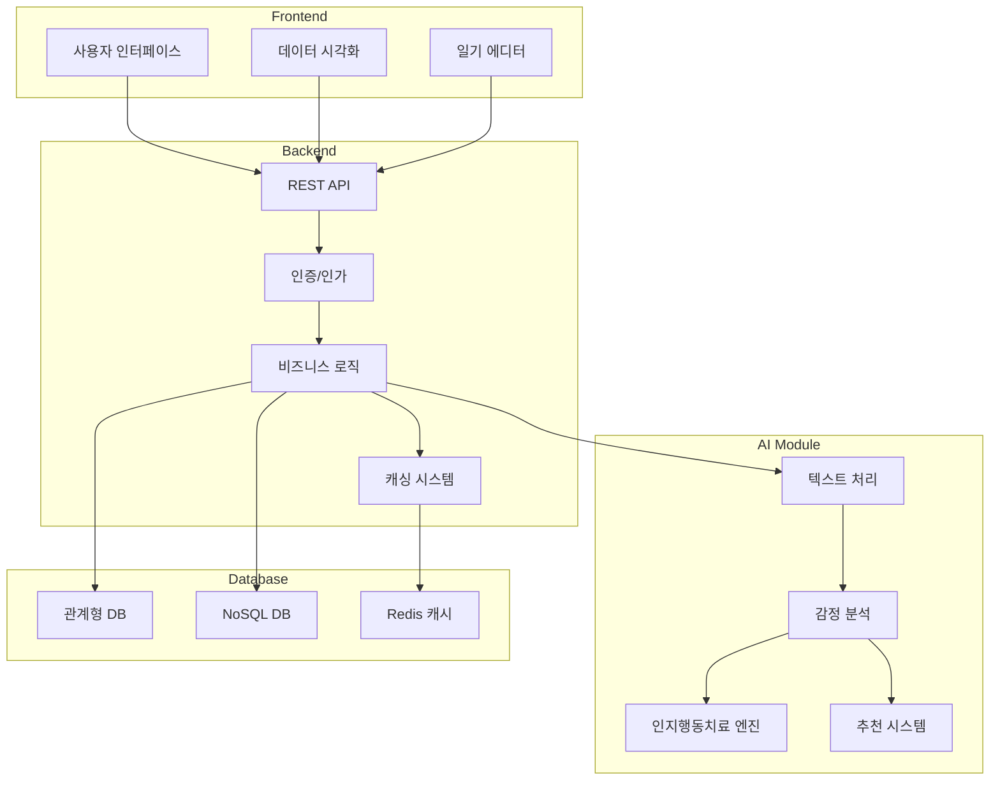
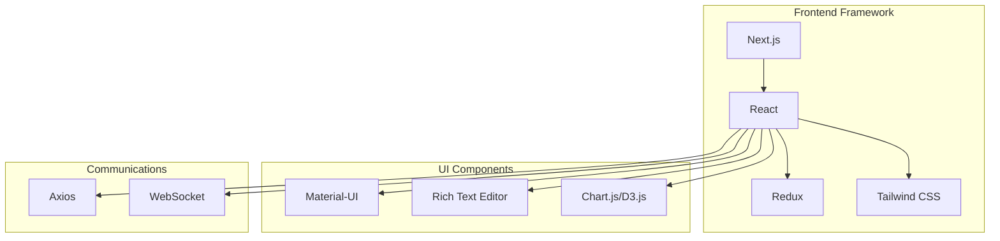
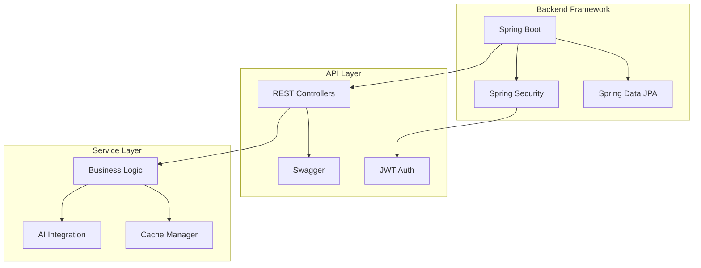
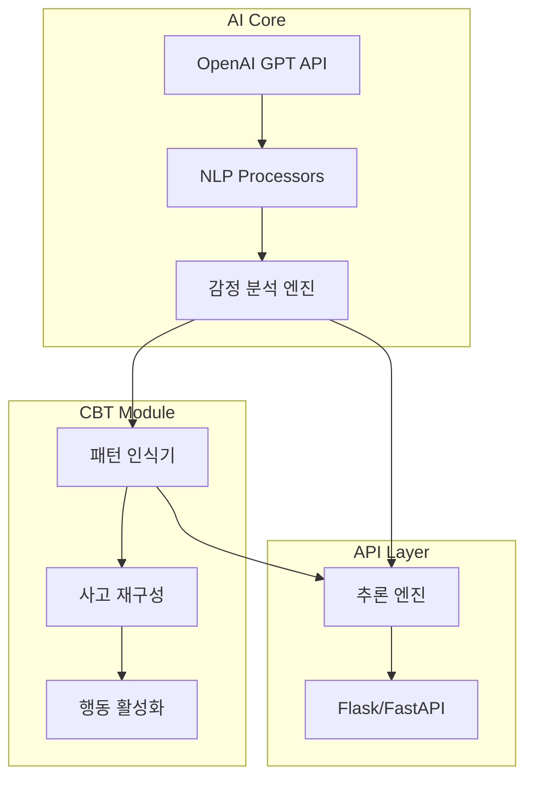
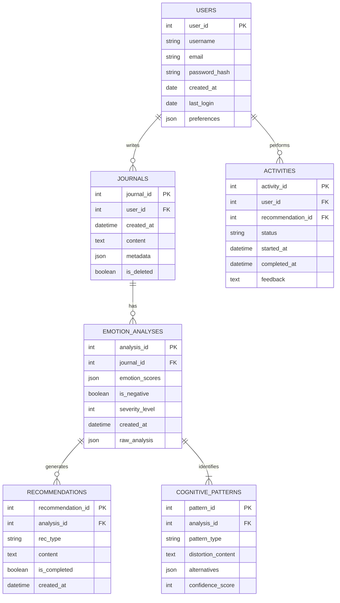
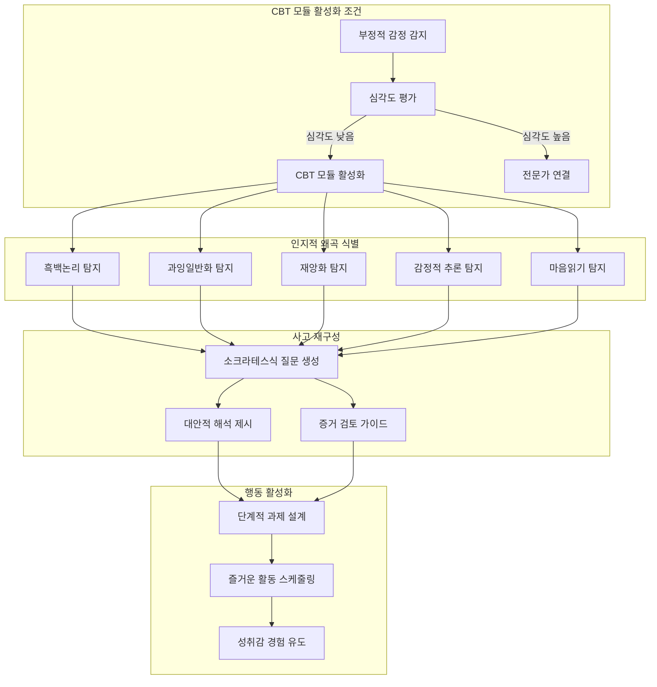
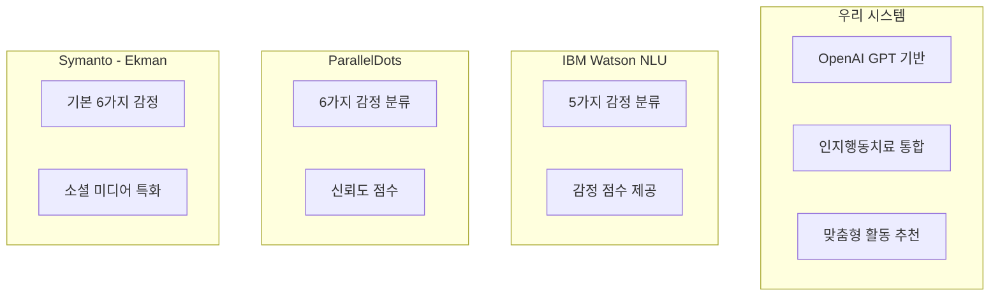
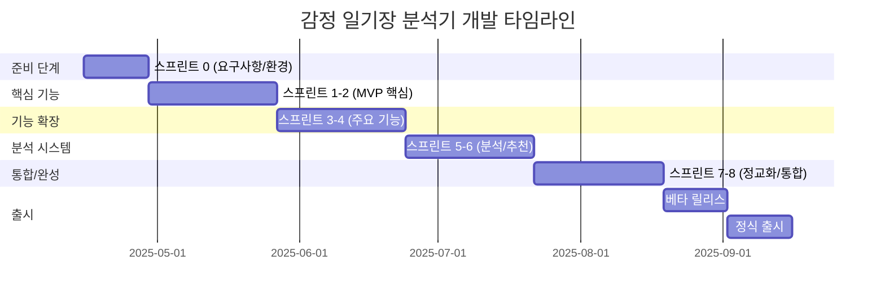

# 감정 일기장 분석기 시스템 흐름도 및 구조 설계

감정 일기장 분석기 프로젝트를 위한 시스템 흐름도와 함께 실제 구현에 필요한 프레임 구조 및 데이터베이스 설계안을 제시합니다. 또한 유사 서비스들의 구조를 비교 분석하여 최적의 설계 방향을 제안합니다.

## 시스템 흐름도 (Mermaid 코드)

아래는 감정 일기장 분석기의 주요 프로세스 흐름을 Mermaid 형식으로 표현한 코드입니다.

```mermaid
flowchart TD
    A[감정 기록 (일기 작성)] --> B[AI 감정 분석]
    B -->|긍정적 감정 우세| C[맞춤 활동 추천]
    C --> D{활동 수행 여부?}
    D -->|Yes| E[커뮤니티 경험 공유]
    D -->|No| F[대체 활동 추천]
    F --> G[감정 변화 추적]
    E --> G
    B -->|부정적 감정 우세| H[위기 개입 평가]
    H --> I{심각도 평가}
    I -->|심각도 높음| J[전문가 연결 안내]
    I -->|심각도 낮음| K[인지행동분석 모듈]
    K --> L[부정적 사고 패턴 식별]
    L --> M[사고 재구성 가이드]
    M --> N[대안적 사고 제시]
    N --> O[행동 활성화 전략]
    O --> P[자가 관리 가이드]
    P --> G
    J --> G
```

이 흐름도는 감정 일기 입력부터 AI 분석, 감정 유형별 대응 경로, 그리고 인지행동치료(CBT) 모듈까지의 전체 프로세스를 보여줍니다.

## 시스템 아키텍처 구조

### 전체 아키텍처 프레임

감정 일기장 분석기는 다음과 같은 주요 컴포넌트로 구성됩니다:



### 기술 스택 구성요소

#### 1. Frontend 프레임



#### 2. Backend 프레임



#### 3. AI 모듈 프레임



## 데이터베이스 스키마 설계

### 관계형 데이터베이스 (PostgreSQL/MariaDB)



### NoSQL 데이터베이스 (MongoDB)

NoSQL 데이터베이스는 다음과 같은 컬렉션으로 구성됩니다:

1. `users` - 사용자 프로필 정보
2. `journals` - 일기 전체 내용과 메타데이터
3. `emotions` - 감정 분석 결과와 시계열 데이터
4. `cbt_sessions` - 인지행동치료 세션 정보와 진행 상태
5. `recommendations` - 사용자별 추천 활동 히스토리

## 인지행동치료(CBT) 모듈 상세 설계

### 인지행동 분석 모듈 구조



## 유사 감정 분석 서비스와의 데이터베이스 구조 비교

### 1. 감정 분석 데이터셋 접근법 비교

현재 감정 분석 관련 데이터셋들은 다양한 방식으로 구조화되어 있습니다:

```mermaid
flowchart LR
    subgraph "우리 시스템"
        OUR1[6가지 기본 감정]
        OUR2[강도 측정(1-10)]
        OUR3[인지왜곡 유형 분류]
    end
    
    subgraph "EMOTIC 데이터셋"
        EMO1[26가지 감정 카테고리]
        EMO2[Valence-Arousal-Dominance]
    end
    
    subgraph "EmoBank"
        EB1[VAD 표현 방식]
        EB2[다중 장르 균형]
    end
    
    subgraph "ExpW 데이터셋"
        EX1[7가지 기본 표정 인식]
        EX2[91,793 얼굴 이미지]
    end
```

비교 분석 결과, 우리 시스템은 텍스트 기반 감정 분석에 초점을 맞추고 있으며, 인지왜곡 유형까지 분류하는 차별화된 접근법을 제공합니다.

### 2. 감정 분석 API 아키텍처 비교

현재 시장에 있는 감정 분석 API들과 우리 시스템의 비교:



## 프로젝트 구현 프레임워크

### 애자일 개발 방법론 적용

이 프로젝트는 애자일 방법론을 적용하여 8개의 스프린트로 개발됩니다:



## 결론

감정 일기장 분석기는 현대인의 정신 건강 관리를 위한 혁신적인 솔루션입니다. 제시된 Mermaid 다이어그램과 시스템 설계는 이 서비스의 개발 방향을 명확히 하고, 특히 인지행동치료(CBT) 모듈을 통합함으로써 부정적 감정 감지 시 전문적인 개입이 가능한 차별화된 서비스를 구축할 수 있는 청사진을 제공합니다.

이 프로젝트는 사용자 중심의 AI 기반 정신 건강 관리 서비스로, 감정 데이터베이스 구축 및 패턴 인식을 통해 사용자의 정신 건강 증진에 기여할 것입니다.